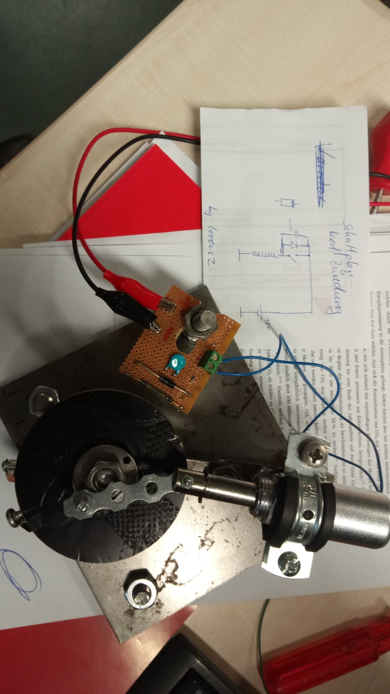
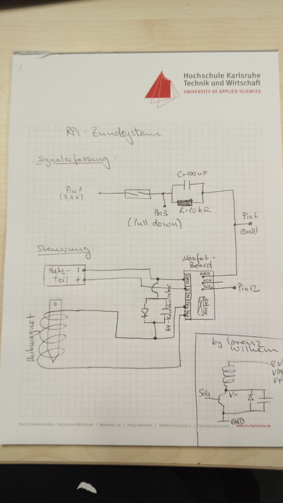

# GenLAB_ExpLabor_Hubmotor

Um Daten hochzuladen, müssen Sie sich zunächst bei GitHub.com registrieren. 
Es wird jeweils nur einem Mitglied der Gruppe Schreibzugriff gewährt. Es sollte der Gruppensprecher / die Gruppensprecherin sein.

Nach der Registrierung senden Sie bitte den Benutzernamen an 
ferhat.aslan@hs-karlsruhe.de 
(mit Betreff: Github-Schreibrechte), um Schreibrechte erhalten zu können. 

## Schaltplan Reed-Zündung

## Schaltplan RPI-Zündung

